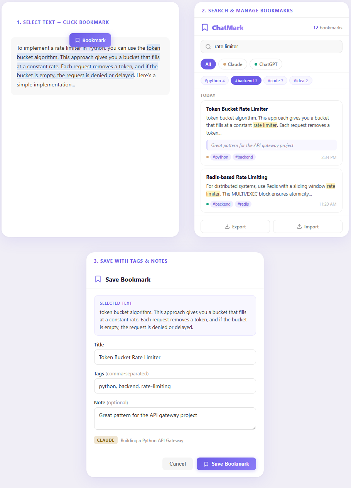

# ChatMark — Bookmark Moments in Your AI Conversations

**The first browser extension that lets you highlight, bookmark, and search specific sections *within* AI chat conversations — across Claude, ChatGPT, Gemini, and Copilot.**



---

## The Problem

You've been there. A 45-minute deep conversation with Claude about system architecture. A back-and-forth with ChatGPT that produced the perfect regex. A Gemini session where the AI finally explained that tricky concept in a way that clicked.

Then two weeks later, you need it again.

You open the platform. You scroll. You search. The word you remember appears in 7 different chats. You click into each one and land at the top — not at the part you need. The nugget is buried somewhere in a wall of text, and you're back to scrolling.

**Your AI conversations are full of gold. But there's no way to pin the moments that matter.**
## The Solution

ChatMark lets you **select any text** inside an AI conversation, **bookmark it** with a title, tags, and notes, and **jump back to that exact spot** later — even weeks later, even across different platforms.

No more scrolling. No more "I know it was in one of these chats." Just click, bookmark, find.

---

## How It Works

### 1. Select text → Click Bookmark
Highlight any section of an AI response. A purple **Bookmark** button appears above your selection.

### 2. Save with context
Add a title, tags (e.g. `#python`, `#architecture`, `#important`), and an optional note to remind yourself *why* this matters.

### 3. Search & jump back
Open the ChatMark popup to search across all your bookmarks. Filter by platform, browse by tags, and click **Go to chat** — the browser opens the conversation and scrolls directly to the bookmarked text, highlighted so you can spot it instantly.
---

## Features

- **Text-level bookmarking** — Don't just save a whole message. Highlight the exact sentence, paragraph, or code block you need.
- **Works across platforms** — Claude, ChatGPT, Gemini, and Microsoft Copilot. One extension, one bookmark library.
- **Full-text search** — Search across titles, bookmarked text, notes, and tags. Matching terms are highlighted in yellow.
- **Platform filters** — See only your Claude bookmarks, or only ChatGPT, or all of them together.
- **Tag system** — Organize bookmarks with tags. A clickable tag cloud appears when you have enough bookmarks.
- **Deep-link navigation** — Uses Chrome's [Text Fragments API](https://web.dev/articles/text-fragments) plus a JS fallback to scroll directly to the bookmarked text.
- **Date grouping** — Bookmarks are grouped by Today, Yesterday, and older dates.
- **Export / Import** — Back up your bookmarks as JSON or share them between devices.
- **Right-click menu** — Quick-bookmark selected text via the context menu without opening the dialog.
- **100% local** — All data stays in your browser. No accounts, no servers, no tracking.

---

## Supported Platforms

| Platform | URL | Status |
|----------|-----|--------|
| Claude | `claude.ai` | Supported |
| ChatGPT | `chatgpt.com` / `chat.openai.com` | Supported |
| Gemini | `gemini.google.com` | Supported |
| Copilot | `copilot.microsoft.com` | Supported |
---

## Installation

### From source (Developer Mode)

1. **Clone this repo**
   ```bash
   git clone https://github.com/YOUR_USERNAME/chatmark-extension.git
   ```

2. **Open Chrome Extensions**
   - Navigate to `chrome://extensions`
   - Enable **Developer mode** (toggle in the top right)

3. **Load the extension**
   - Click **Load unpacked**
   - Select the cloned `chatmark-extension` folder

4. **You're live**
   - Visit any supported AI chat platform
   - Select some text and the purple **Bookmark** button will appear

### From Chrome Web Store
   Coming soon.

---

## Usage
**Bookmarking:**
1. Go to any supported AI chat platform (Claude, ChatGPT, Gemini, Copilot)
2. Select any text in a conversation
3. Click the purple **Bookmark** button that appears
4. Add a title, tags, and optional note
5. Click **Save Bookmark** (or press `Ctrl+Enter`)

**Finding bookmarks:**
1. Click the ChatMark icon in your browser toolbar
2. Use the search bar to find bookmarks by text, title, tags, or notes
3. Use the platform filter chips (All / Claude / ChatGPT / Gemini) to narrow results
4. Click tags in the tag cloud to filter by topic

**Navigating back:**
1. Click the **Go to chat** icon (↗) on any bookmark card
2. Chrome opens the conversation and scrolls directly to the bookmarked text
3. The text is highlighted so you can spot it immediately

**Quick bookmark (right-click):**
1. Select text on any supported platform
2. Right-click → **Bookmark this with ChatMark**
3. Saves instantly without opening the dialog

---

## Project Structure
```
chatmark-extension/
├── manifest.json          # Chrome Extension manifest (MV3)
├── content.js             # Injected into AI chat pages — handles selection, bookmarking, scroll
├── content.css            # Styles for the floating button, dialog, highlights, and toast
├── background.js          # Service worker — context menu, messaging
├── popup/
│   ├── popup.html         # Bookmark manager UI
│   ├── popup.js           # Search, filter, navigate, export/import logic
│   └── popup.css          # Popup styles
├── icons/
│   ├── icon16.png
│   ├── icon48.png
│   └── icon128.png
└── README.md
```

---

## Technical Details

- **Manifest V3** — Uses Chrome's latest extension platform
- **Text Fragments API** — Navigates to bookmarks using `#:~:text=` URL fragments for browser-native scrolling
- **JS Fallback Scroll** — When text fragments fail (e.g., same-page navigation), a retry-based DOM walker finds and scrolls to the text
- **Chrome Storage API** — All bookmarks stored locally via `chrome.storage.local`
- **Zero dependencies** — No build step, no npm, no frameworks. Pure vanilla JS/CSS.
---

## Contributing

This is an early-stage project and feedback is welcome. If you'd like to contribute:

1. Fork the repo
2. Create a feature branch (`git checkout -b feature/your-feature`)
3. Commit your changes (`git commit -m 'Add your feature'`)
4. Push to the branch (`git push origin feature/your-feature`)
5. Open a Pull Request

**Ideas for contribution:**
- Firefox / Edge Add-on support
- Keyboard shortcuts (`Ctrl+Shift+B` to bookmark)
- Cloud sync for bookmarks across devices
- Bookmark collections / folders
- Dark mode support for the popup
- Support for more platforms (Perplexity, Grok, DeepSeek, etc.)

---

## License

MIT License — see [LICENSE](LICENSE) for details.

---

Built by [Muyiwa Adeniyi](https://github.com/YOUR_USERNAME) — because AI conversations deserve bookmarks too.